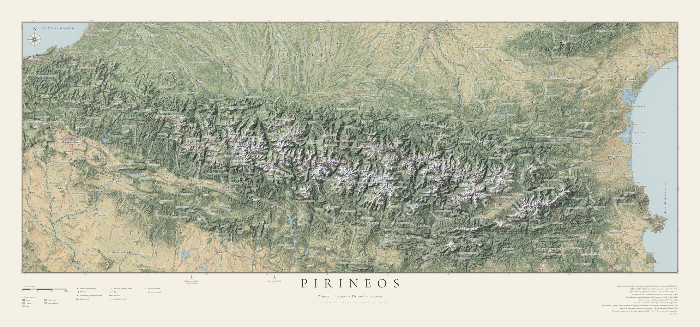
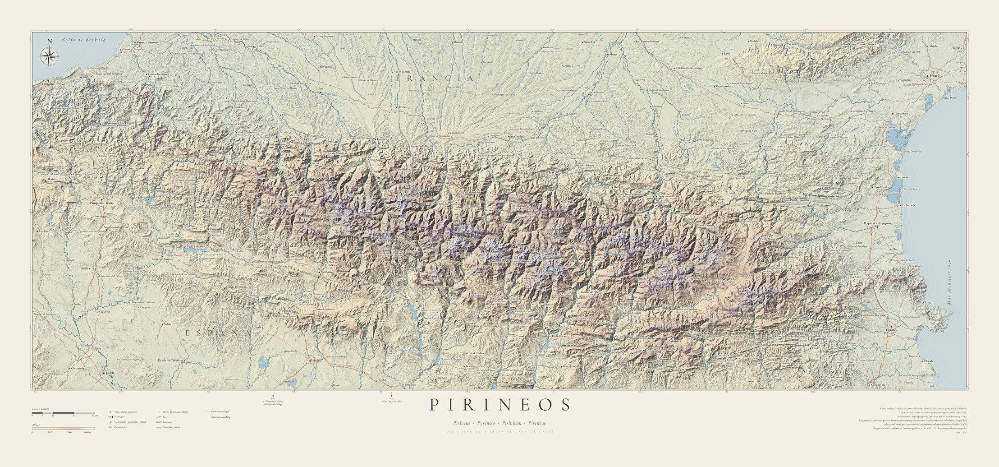

# Pirineos — mapa de relieve para imprimir (150 cm)

Lámina decorativa de los Pirineos, del golfo de Bizkaia al cabo de Creus, pensada para
imprimir a **150 × 70 cm** (mapa de 140 cm a ~301 ppp, escala 1:320.000) y enmarcar.
Hay dos versiones con la misma cartografía y rotulación:

**Color natural**: bosques, prados, cultivos, roca y nieve



**Clásica**: tintas hipsométricas por altitud



**Todo se calcula a partir de datos cartográficos reales, sin generación de imágenes por IA:**

| Elemento | Fuente |
|---|---|
| Relieve sombreado, tintas hipsométricas | Copernicus DEM GLO-30 (30 m): © DLR e.V. 2010–2014, © Airbus Defence and Space GmbH 2014–2018, programa Copernicus (UE/ESA) |
| Bosque, matorral, prado, cultivo, roca, urbano (versión color) | ESA WorldCover 10 m 2021 (© ESA, CC BY 4.0) |
| Tono regional del terreno (versión color) | Sentinel-2 cloudless 2023, s2maps.eu, EOX IT Services GmbH (datos Copernicus Sentinel modificados, **CC BY-NC-SA 4.0: solo uso no comercial**) |
| Nieve (versión color) | Manto estacional modelado sobre el DEM: cota de nieve ~2.250 m en caras norte y ~2.650 m en caras sur, que baja ~400 m más en cumbres y cordales (posición alta en su entorno de ~3 km) sin tocar fondos de valle; sin nieve en paredes de más de ~45°, más en canales |
| Grosor de los ríos (crece aguas abajo) | Área de cuenca calculada sobre el mismo DEM (`pysheds`) |
| Ríos, lagos, embalses, ibones, carreteras (autopistas, principales y secundarias), frontera, puertos de montaña (collados con nombre y altitud), posición y población de municipios, nombres de embalses | © colaboradores de OpenStreetMap (ODbL), vía teselas OpenMapTiles de OpenFreeMap y Nominatim |
| Cimas | Coordenadas públicas, recolocadas sobre el máximo real del DEM; altitudes oficiales |
| Selección homogénea de municipios, monumentos, patrimonio, valles y cimas adicionales | Wikidata (CC0): población, nº de Wikipedias y protección patrimonial (BIC, monument historique, Patrimonio Mundial…); cimas OSM que dominan 8 km a la redonda en el DEM; ríos con ≥ 300 km² de cuenca |
| Rosa de los vientos | Orientada al norte geográfico del meridiano que pasa por ella (en la cónica de Lambert la cuadrícula gira hasta ±2° en los extremos) |
| Tipografías | Cormorant Garamond, EB Garamond, Josefin Sans (SIL OFL) |

## Cómo se genera

```bash
pip install -r requirements.txt
./run_all.sh                 # las dos láminas: output/pirineo_150cm.* y output/pirineo_color_150cm.*
STYLES=color ./run_all.sh    # solo la versión en color
F=4 ./run_all.sh             # vistas previas rápidas a 1/4 (work/compose*_f4.png)
```

| Paso | Script | Qué hace |
|---|---|---|
| 0 | `00_download.sh` | Descarga los tiles del DEM (~650 MB), las teselas OSM (~30 MB) y las fuentes |
| 1 | `01_prepare_dem.py` | Mosaico y reproyección a cónica conforme de Lambert centrada en 0°43′ E (27 m/píxel) |
| 2 | `04_osm_hydro_roads.py` | Extrae ríos/agua/carreteras/frontera de OSM y calcula el área de cuenca |
| 2b | `04b_osm_parks.py` | (Opcional, desactivado en la lámina: `DRAW_PARKS` en `03_compose.py`) une los contornos de parques nacionales y naturales de OSM |
| 3 | `05_download_color.sh` | (color) Descarga WorldCover (~450 MB) y las teselas Sentinel-2 cloudless (~120 MB) |
| 4 | `06_landcover.py`, `07_satellite.py` | (color) Reproyectan cobertura y satélite al grid del mapa |
| 5 | `08_color_base.py` | (color) Mezcla en CIELAB la paleta por cobertura con el tono del satélite aclarado, y añade la nieve |
| 5b | `05b_wikidata.sh`, `09_select_labels.py` | Relevancia desde Wikidata y selección con el mismo criterio en todo el mapa (distancia mínima entre rótulos del mismo tipo) |
| 6 | `02_render_relief.py [F] [clasico\|color]` | Sombreado multidireccional (luz del NO), oclusión de valles, sombras frías, perspectiva aérea, agua y mar |
| 7 | `03_compose.py [F] [clasico\|color]` | Lámina final: ríos y carreteras (`linework.py`), rótulos, puertos, rosa de los vientos, salidas por el borde, gratícula, cartela, leyenda y créditos |

Toponimia en `places.py`: cimas, municipios (con su población, de OpenStreetMap: el punto y el nombre crecen con ella en escala logarítmica), monumentos y lugares de interés cultural (y alguno personal, como La Huerta), embalses, valles (rotulados a lo largo de su río o de su eje), parajes naturales (cursiva verde), puertos de montaña (Monrepós y Somport siempre; el resto solo si caben) y salidas por el borde hacia lugares de fuera del mapa (A‑23 hacia Villanueva y Peñaflor de Gállego; A‑22 hacia Sant Cugat del Vallès). Los monumentos ya elegidos quedan fijados en `POIS_WD`; los nuevos de Wikidata solo entran donde quepan sin pisar nada. Los rótulos se colocan solos en la primera de ocho posiciones alrededor del punto que no pise otro rótulo o símbolo; la posición indicada en `places.py` es solo la preferida. Lo elegido a mano en `places.py` se coloca primero; lo automático solo entra si cabe sin pisar nada.
En `08_color_base.py` se ajustan los colores por cobertura, el peso del satélite y la cota de nieve.

## Imprimir

- Archivos: `output/pirineo_color_150cm.tif` o `output/pirineo_150cm.tif` (17.731 × 8.286 px, 301 ppp, RGB).
- Papel mate o *fine art* (algodón / Hahnemühle Photo Rag o similar); evitar brillo.
- Marco fino de madera natural o negro; el propio diseño ya incluye margen de paspartú.
- La versión en color usa Sentinel-2 cloudless (CC BY-NC-SA): bien para casa, no para venderla.
